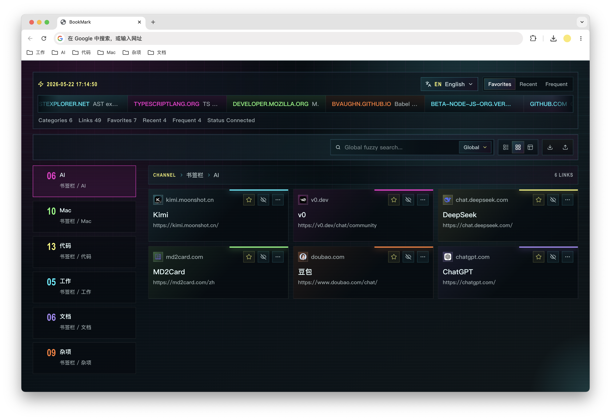

# Cyberpunk Bookmark

A cyberpunk-style Chrome new tab extension that turns browser bookmarks into a searchable visual dashboard.



## Features

- Automatically reads Chrome bookmarks and groups them by folder.
- Displays category navigation, nested bookmark channels, and masonry bookmark cards.
- Supports global fuzzy search and current-category search.
- Includes favorite, recent, and frequent quick-access lanes.
- Tracks local open frequency and last-opened time for sorting.
- Provides compact, standard, and showcase density modes.
- Offers Chinese and English UI switching without changing user bookmark data.
- Handles empty bookmark libraries with a dedicated onboarding state.
- Supports opening links in a new tab, current tab, or new window, plus copy-link actions.
- Uses a cyberpunk HUD visual style with responsive desktop and mobile layouts.

## Development

Use the project Node.js version before installing dependencies:

```bash
fnm use
```

Install dependencies:

```bash
pnpm install
```

Start the development server:

```bash
pnpm run dev
```

Run lint:

```bash
pnpm run lint
```

Auto-fix lint issues:

```bash
pnpm run lint:fix
```

Build the extension:

```bash
pnpm run build
```

The production extension files are generated in `dist/`.

## Download Release

Download the latest `cyber-bookmark-*.zip` from GitHub Releases, unzip it, then load the extracted folder in Chrome.

## Install In Chrome

1. Download and unzip the release package, or run `pnpm run build` locally.
2. Open Chrome and go to `chrome://extensions/`.
3. Enable **Developer mode**.
4. Click **Load unpacked**.
5. Select the unzipped release folder or the generated `dist/` directory.
6. Open a new tab to use the dashboard.

## Publish A Release

Generate the changelog with the Angular conventional changelog preset:

```bash
pnpm run changelog
```

Commit the changelog and version changes, then create and push a version tag to publish a release:

```bash
git tag v1.0.0
git push origin v1.0.0
```

GitHub Actions will build the extension and upload `cyber-bookmark-1.0.0.zip` to the release.

The extension needs the Chrome `bookmarks` permission to read your bookmarks and the `favicon` permission to display site icons. It only reorganizes bookmarks for display; it does not edit your browser bookmarks.
